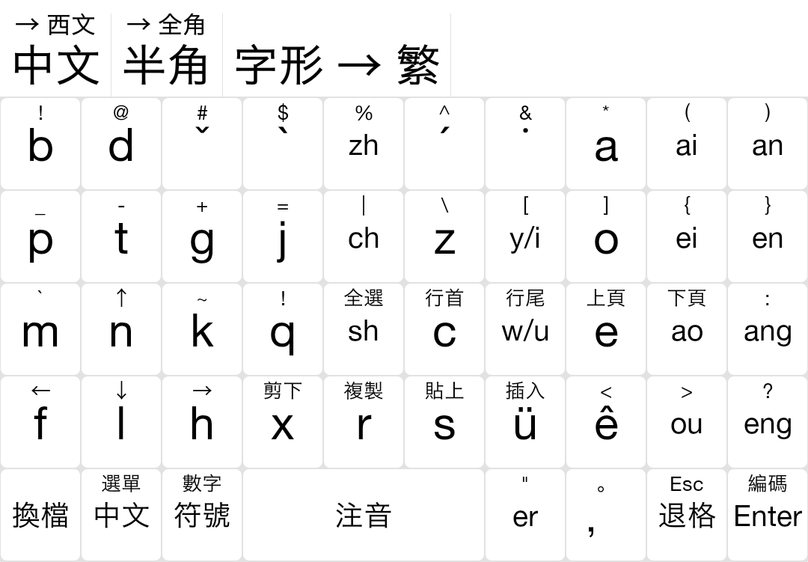

# keyboard-bopomofo-pinyin
使用拼音符號的大千式注音鍵盤

## 原因
對於熟習漢語拼音者，學習注音有兩大障礙：
1. 記住注音符號ㄅㄆㄇㄈ等。
2. 掌握注音拼寫規則，即忘記漢語拼音的各種特殊式如 `iu = iou`，`ong = ueng`，`y/w`等。

同時，若使用注音輸入法，其通常的大千式佈局不同於QWERTY佈局，亦需適應。

本鍵盤方案在標準大千式鍵盤的基礎上，將注音符號改爲對應的漢語拼音，如ㄅㄆㄇㄈ改爲bpmf顯示。爲拼音用戶解決了第一個障礙。第一步先從規則入手，從鍵盤佈局入手。待熟悉後，再改回注音符號鍵盤，便更容易記住注音符號。

另一方面，熟悉注音的用戶在學習漢語拼音時，使用此鍵盤，亦方便掌握注音符號對應的拼音字母。

## 截圖

## 使用方法
此鍵盤佈局在安卓手機的[同文輸入法](https://github.com/osfans/trime)上使用。可直接將trime.custom.yaml（或將內容複製到已有的trime.custom.yaml中）複製到rime目錄下，並重新部署即可。

## 實現
在同文輸入法內置注音鍵盤上修改而成。
